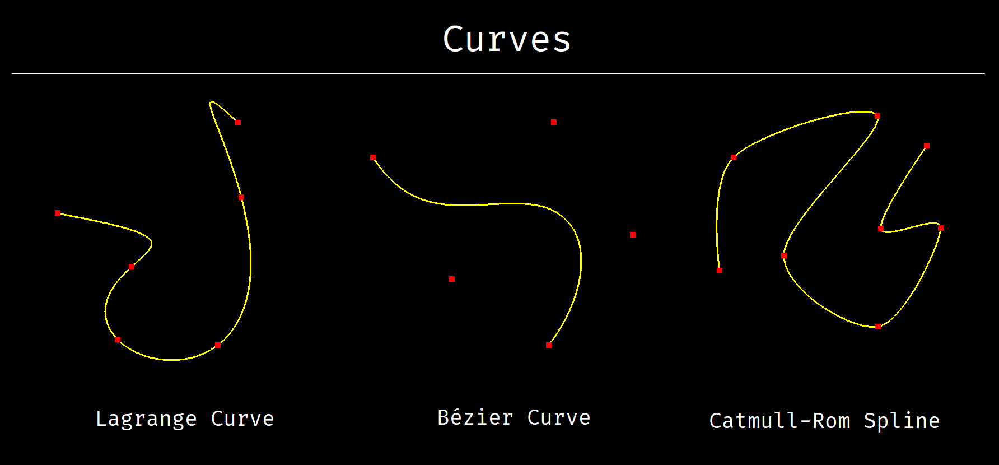
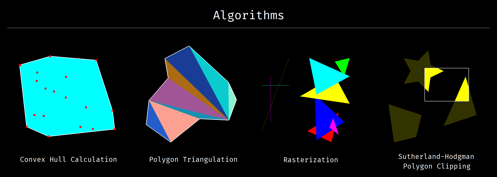
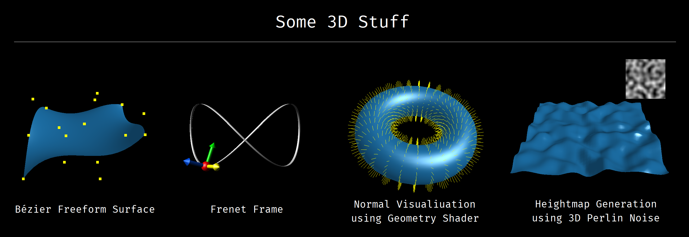
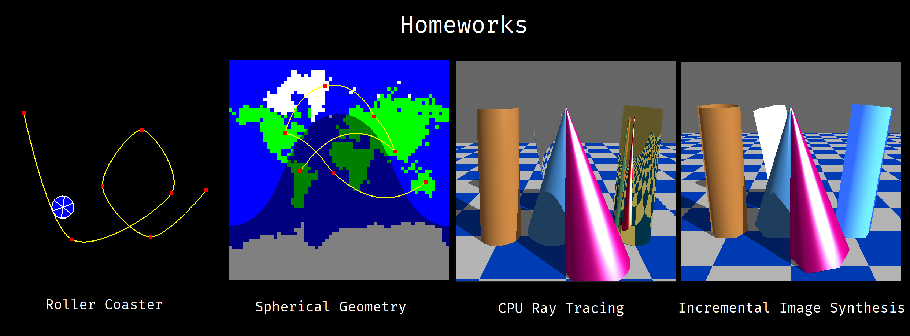
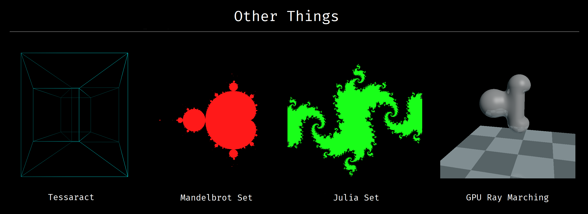

# About This Repo

A collection of graphics programming experiments and BME course implementations.
This repository covers the full pipeline, from 2D curves and 3D rasterization (clipping, triangulation) to ray marching and shader programming. It serves as a personal laboratory for mastering the math and logic behind the rendering process.

# Implementation Note

While these projects utilize the OpenGL framework provided by the BME course, all logic and rendering algorithms were developed independently. Without access to official source code, I wrote every demo from scratch, translating visual requirements into functional C++ code.

# Screenshots

